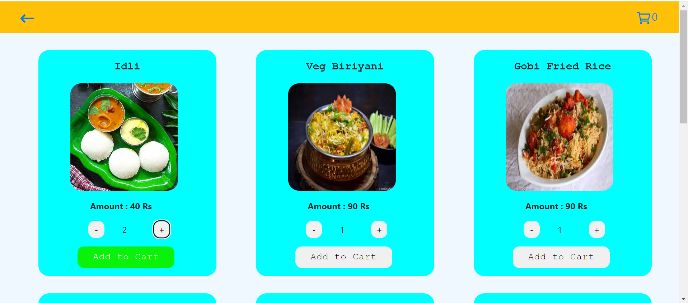
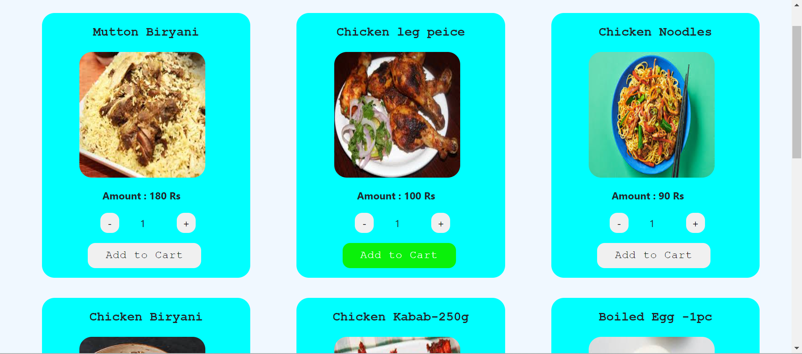
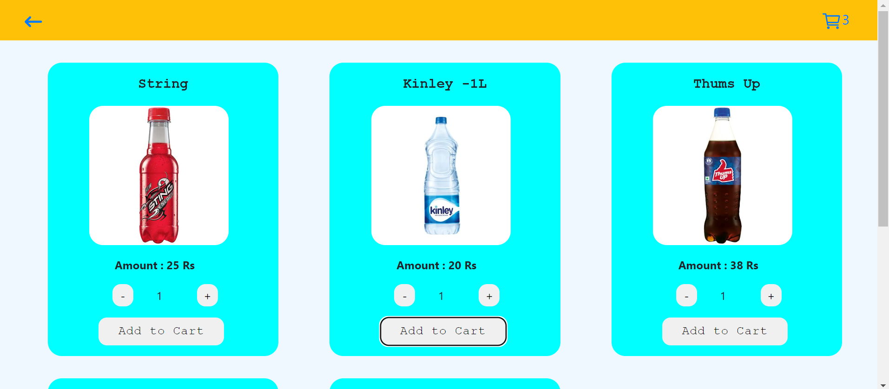
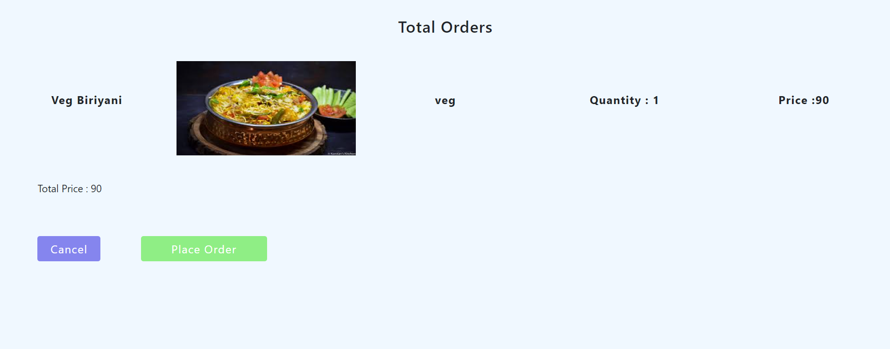
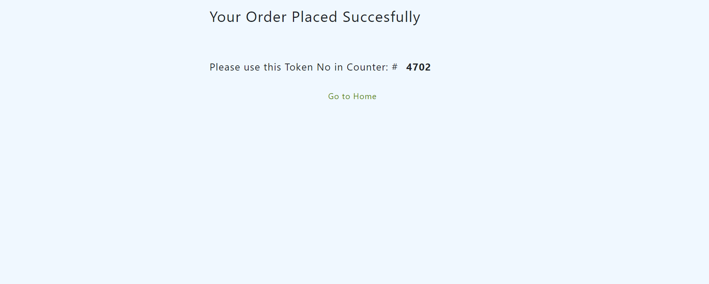

"# MenuScreen"
`MenuScreen is web application that healps the hotels in this application Customers can browse the menu, select items, and place orders through an intuitive and user-friendly interface and it genarate 4 digit id that id helps the hotel owner to tract the order items .`

### PREREQUISITES

I hope you have installed nodejs

In Order To use the codebase you need to clone it.

```
$ git clone https://github.com/darshanbr7/MenuScreen.git
```

After cloning, you should install the dependencies by running

```
npm install
```

### Folder Structure

Below is the Folder structure of the codebase:

```
├── README.md
├── client # front-end code
│   ├── pulic
│   ├── src
|   |    ├── components
|   |        ├── beverages
|   |        ├── cartItems
|   |        ├── helper
|   |        ├── homePage
|   |        ├── images
|   |        ├── mainCSS
|   |        ├── Navbar
|   |        ├── nonVegItems
|   |        ├── order
|   |        ├── vegItems
│   ├── App.js
│   ├── App.css
│   ├── Context.jsx
│   ├── index.css
│   └── index.js
├── server  # backend code
│   ├── App
│   │   ├── controller
│   │   ├── middleware
│   │   ├── module
│   ├── Config
│   │   ├── dbConnection.js
│   │   ├── router.js
│   └── index.js
```

## this applction is deploied in vercel

link : https://menu-screen.vercel.app/

### TECH STACK & PACKAGES USED in front-end

- react
- Bootstrap
- tailwindCSS
- axios
- react-router-dom

### TECH STACK & PACKAGES USED in Back-end

- NodeJS
- ExpressJS
- cors
- bodyParser
- mongoose

### BELOW ARE THE SCREENSHOT OF THE APPLICATION

vegItems :


nonVegItems :


beverages :


cartItems :


order :

